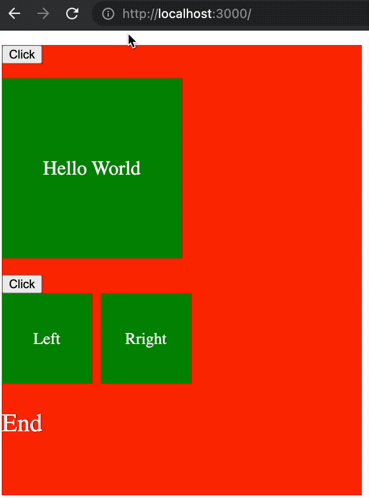
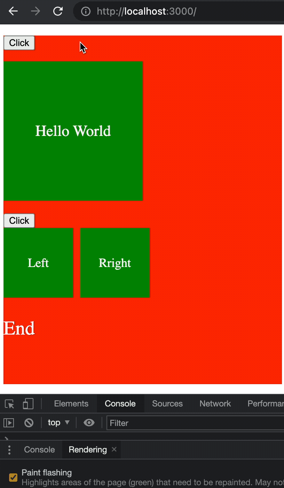

# react-performant-collapsible
A performant React.js Collapsible component.



## Why it's performant?

It doesn't repaint at all during the collapse/expand animation:


## Installation

```sh
npm i react-performant-collapsible
```

or

```sh
yarn add react-performant-collapsible
```

or

```sh
pnpm i react-performant-collapsible
```

## Props

|               Prop Name |    Type    | Required |                                                                                                 Note                                                                                                 |
|------------------------:|:----------:|:--------:|:----------------------------------------------------------------------------------------------------------------------------------------------------------------------------------------------------:|
|               className |   String   |   false  | className for the wrapper element                                                                                                                                                                    |
|                   style |   Object   |   false  | style for the wrapper element                                                                                                                                                                        |
|               maskColor |   String   |   false  | background color for the mask element                                                                                                                                                                |
|       animationDuration |   String   |   false  | how long does the collapse/expand animation take. format is like `1s` or `400ms`, same as [CSS property `transition-duration`](https://developer.mozilla.org/en-US/docs/Web/CSS/transition-duration) |
| animationTimingFunction |   String   |   false  | format is like `linear` or `cubic-bezier(.29, 1.01, 1, -0.68)`, same as [CSS property `transition-timing-function`](https://developer.mozilla.org/en-US/docs/Web/CSS/transition-timing-function )    |
|             collapsible |   Boolean  |   true   | is currently collapsed or not                                                                                                                                                                        |
|                children | React Node |   true   |                                                                                                                                                                                                      |

## What is props `maskColor` used for?

Sometimes if the background color is not white, you need to set the `maskColor` to match the background color, e.g.

```jsx
<div style={{background: 'red'}}>
  <Collapsible collapsible={state.collapsible} maskColor="red">
    { someChildren }
  </Collapsible>
</div>
```
